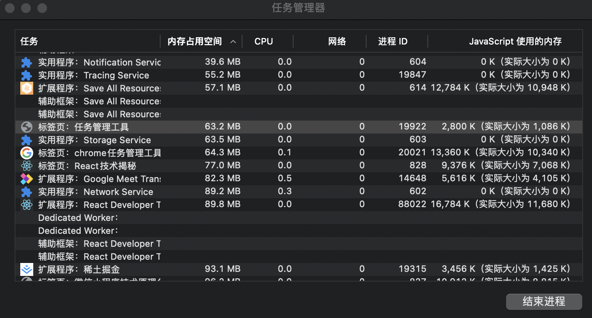
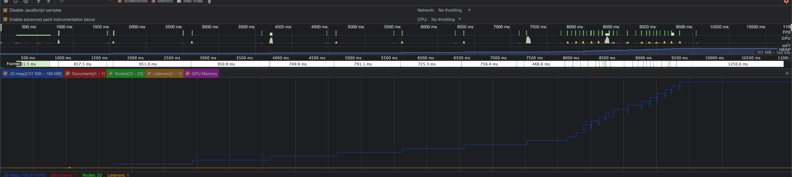
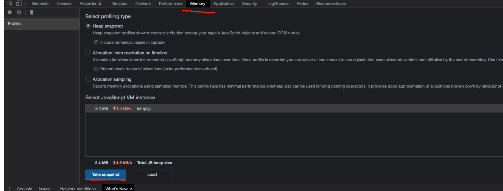
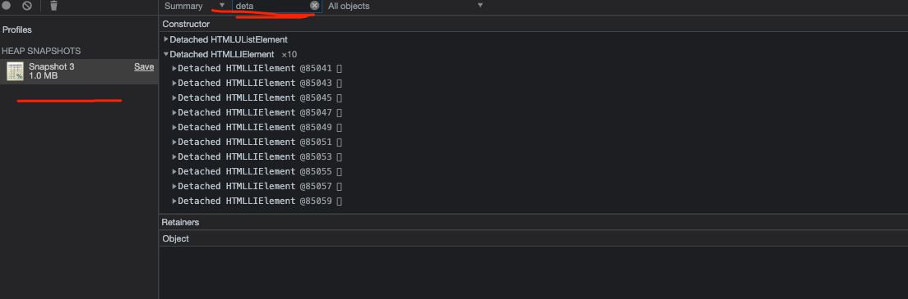

### 内存问题的外在表现（网络正常的情况下）

1. 页面出现延迟加载或经常性暂停 --> 使用有的地方卡有的地方流畅
2. 页面持续性出现糟糕的性能 --> 用就卡
3. 页面的性能随时间的延长越来越差 --> 直接说就是放着不用会越来越卡

### 监控内存的方式

1. 浏览器任务管理器
2. Timeline时序图记录
3. 堆快照查找分离dom
4. 是否在进行频繁的垃圾回收

### 判断内存问题的标准

1. 内存泄露: 内存使用持续升高
2. 内存膨胀: 在多数设备上都存在性能问题
3. 频繁垃圾回收: 通过内存变化图进行分析

### google浏览器任务管理器

1. 内存占用空间，表示原声内存，当前界面DOM节点所占据的内存，不断增大代表着不断的新增dom节点
2. JavaScript使用的内存，表示js堆，小括号中的实际大小表示着界面当中所有可达对象正在使用的内存大小。如果这个数字在不断的增大，证明界面中要么在不断的新增对象，要么现有对象在不断的增长

* 这个工具能够帮助发现问题，但是不能知道问题具体出现在哪里

### Timeline记录内存

1. 打开控制台
2. 点击performance
3. 点击左上角小圆点或command + e
4. 疯狂触发分配js堆内存和新增dom节点
5. 停止录制
6. 蓝框（js堆）、红框（文档）、绿框（dom节点）、橙框（侦听器）、粉红框（gpu内存）代表内存占用情况，对应颜色的线条就是内存的走势图

* 这个工具综合渲染时序图，判断操作在哪个步骤内存异常

### 堆快照查找分离dom

找到当前的js堆，然后对它进行照片的留存，有了照片就可以看到里面的所有信息，这是针对分离DOM的一个查找行为

#### 什么是分离dom

分离状态的dom节点：只是在dom树上脱离了，但是在js代码中还在引用它，这种dom就叫做分离dom，我们看不见，但是占据着内存空间的，这就是一个内存泄漏

#### 使用方式

1. 点击图示中的Profiles
2. 再点击下方的Take snapshit
3. 筛选输入deta
4. 可以看到出现创建的dom

这些dom虽然没在页面上展示，但是的确存在内存中，这就照成了空间上的浪费。通过堆快照的功能找到了脚本里面存在的问题，也就是存在所谓的分离dom

### 确定频繁垃圾回收的方式

1. Timeline中频繁的上升下降；蓝线上下幅度较大
2. 任务管理器中数据频繁的增加减小；瞬间增大减小

#### 为什么需要确定频繁垃圾回收

1. gc工作时应用程序是停止的
2. 频繁且过长会导致应用假死
3. 用户使用中感知应用卡顿