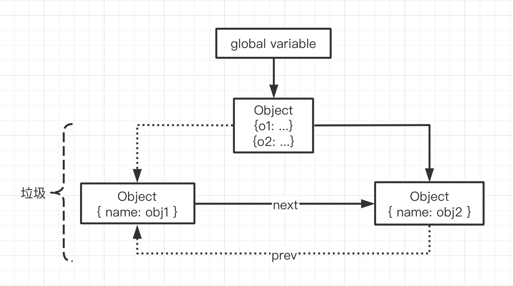
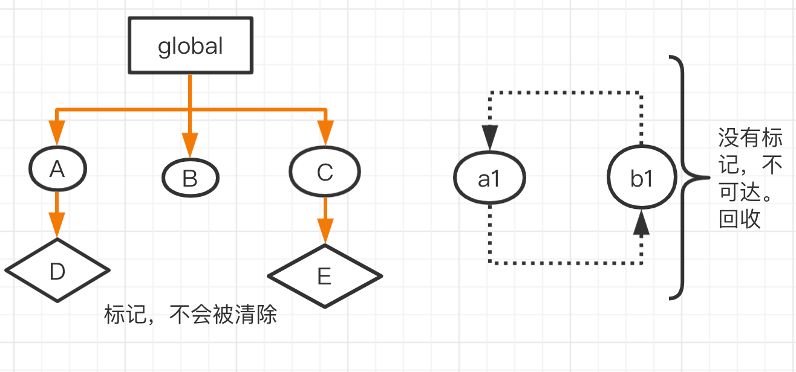
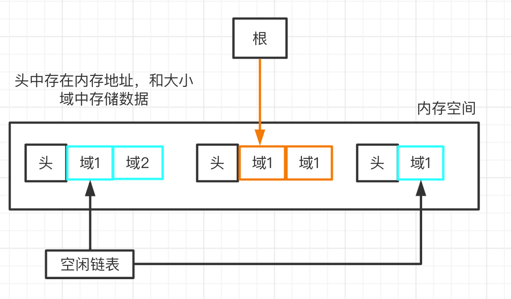
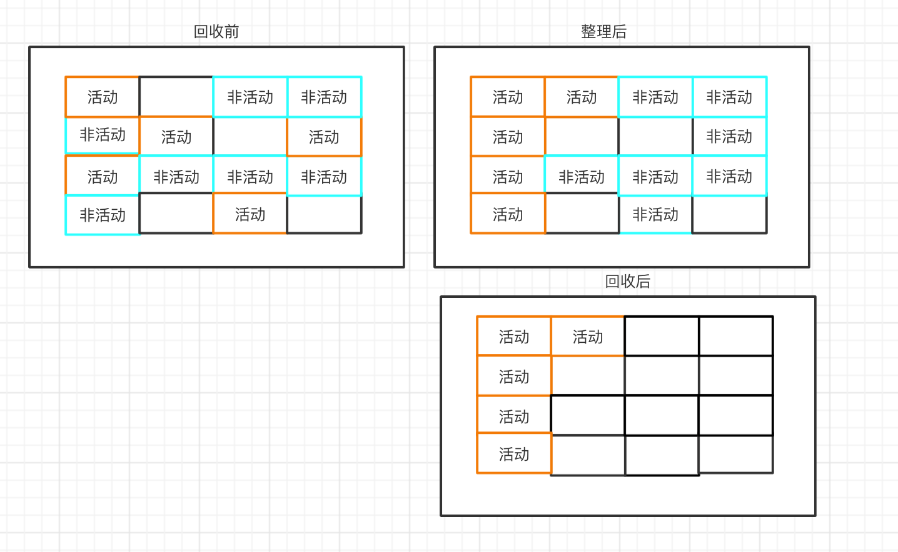

### 垃圾回收

#### JavaScript中的垃圾

1. JavaScript中内存管理是自动的，并没有提供给开发直接调用的api
2. 对象不再被引用时是垃圾
3. 对象不能从根上访问到时是垃圾

#### javaScript中的可达对象是什么

1. 可以被访问到就是可达对象（引用、作用域链）
2. 可达的标准就是从根出发是否能够被找到
3. JavaScript中的根可以理解为全局变量对象


```js
let obj = { name: 'c' }; // 可达的
let a = obj; // 引用数值变化
obj = null; // 'c'是可达的
```

```js
function objGroup(obj1, obj2) {
  obj1.next = obj2;
  obj2.prev = obj1;

  return {
    o1: obj1,
    o2: obj2
  }
};

let obj = objGroup({ name: 'obj1' }, { name: 'obj2' });

obj.o1 = null;
obj.o2.prev = null; // 此时'obj1'不可达 为垃圾
```



### gc算法

#### gc是垃圾回收的简写

gc可以找到内存中的垃圾、并释放和回收空间

#### 在gc中垃圾是什么

1. 程序中不需要使用的对象
2. 程序中不能再访问的对象

#### 算法就是工作时查找和回收所遵循的规则

##### 常见的gc算法

1. 引用计数
2. 标记清除
3. 标记整理

#### 引用计数

##### 引用计数算法实现原理

1. 核心思想：设置引用数，判断当前引用数是否为0
2. 维护一个引用计数器
3. 引用关系改变时修改引用数字
4. 引用数字为0时立即回收

```js
// 被 ageList 引用
const user1 = { age: 11 },
  user2 = { age: 12 },
  user3 = { age: 13 };

const ageList = [user1.age, user2.age, user3.age];

function fn() {
  const num1 = 1;
  const num2 = 2;
};

fn(); // 执行完成 num1 num2 计数为0回收
```

##### 引用计数算法的优缺点

* 优点
1. 发现垃圾立即回收；根据引用数为0判断这个垃圾是否需要回收
2. 最大限度减少程序暂停；内存有上限，即将到达上限，去清除为0的引用，减少程序占满内存的风险

* 缺点
1. 无法回收循环引用的对象
2. 时间开销大；需要维护所有引用数值的变化

```js
function fn() {
  const obj1 = {},
    obj2 = {};

  // 循环引用 引用计数数值不会为0
  obj1.name = obj2;
  obj2.name = obj1;
}

fn();
```
#### 标记清除

##### 标记清除算法实现原理

* 核心思想：分标记和清除两个阶段完成
1. 遍历所有对象找标记活动对象；类似于可达对象
2. 遍历所有对象清除没有标记的对象
3. 回收相应空间；清除出来的空间信息放置在一个空闲链表中



##### 标记清除算法的优缺点

* 优点

1. 解决引用计数循环引用导致无法正常回收的问题；在标记清除算法中，调用完成后的函数内部变量会变成不可达，无法进行标记，会在第二阶段遍历的时候被清除掉

* 缺点
1. 回收空间碎片化，当需要分配2个域大小的空间时，如果之前回收的只有1个域、3个域、4个域，如果使用1个域不够，使用3个域又浪费，只能重新分配内存。这样回收的空间不连续，不能让空间得到最大化的使用。


#### 标记整理

* 标记整理和标记清除基本一样，可以看作是标记清除的增强
* 标记阶段和标记清除的清除阶段一致
* 清除阶段会先整理，移动对象位置

* 相当于对标记清除算法进行了优化，在清除前会先整理标记的对象，确保回收后的地址尽量连续，提高内存中所释放空间的使用。配合标记清除在v8中实现频繁的gc操作。

